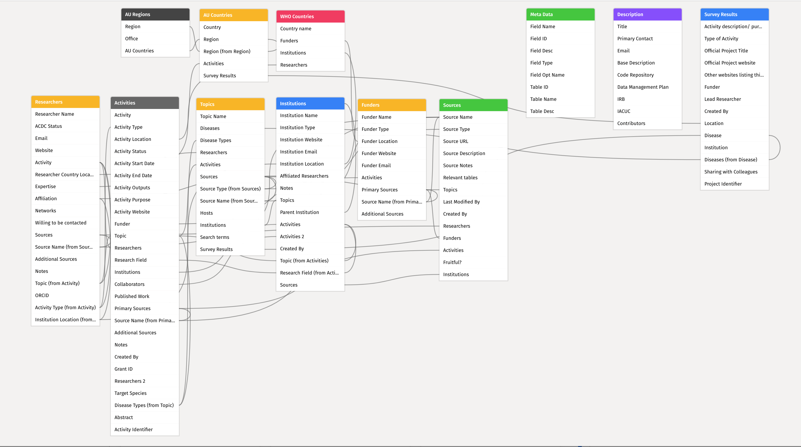

# Database {#database}

The current database is built using [Airtable](https://airtable.com). The current database has the following schema:



This schema can be viewed interactively from here - https://airtable.com/appAL7fJUpBPYtOq4/tblt9ott045tWENcg/viwznxjIFAsTu0jzJ?blocks=bliZ6LV2bkGQNzgKF

## Activities Table {#activities-table}

### Table details

```{r activity-table}
create_data_dictionary(metadata = airtable_metadata, table = "Activities") |>
  (\(x) x$table_details)() |>
  knitr::kable() |>
  kableExtra::row_spec(row = 0, bold = TRUE) |>
  kableExtra::kable_paper(lightable_options = "striped")
```

### Fields details

```{r activity-field-table}
create_data_dictionary(metadata = airtable_metadata, table = "Activities") |>
  (\(x) x$field_details)() |>
  knitr::kable() |>
  kableExtra::row_spec(row = 0, bold = TRUE) |>
  kableExtra::kable_paper(lightable_options = "striped")
```

## AU Countries Table {#au-countries-table}

### Table details

```{r au-countries-table}
create_data_dictionary(metadata = airtable_metadata, table = "AU Countries") |>
  (\(x) x$table_details)() |>
  knitr::kable() |>
  kableExtra::row_spec(row = 0, bold = TRUE) |>
  kableExtra::kable_paper(lightable_options = "striped")
```

### Fields details

```{r au-countries-field-table}
create_data_dictionary(metadata = airtable_metadata, table = "AU Countries") |>
  (\(x) x$field_details)() |>
  knitr::kable() |>
  kableExtra::row_spec(row = 0, bold = TRUE) |>
  kableExtra::kable_paper(lightable_options = "striped")
```

## AU Regions Table {#au-regions-table}

### Table details

```{r au-regions-table}
create_data_dictionary(metadata = airtable_metadata, table = "AU Regions") |>
  (\(x) x$table_details)() |>
  knitr::kable() |>
  kableExtra::row_spec(row = 0, bold = TRUE) |>
  kableExtra::kable_paper(lightable_options = "striped")
```

### Fields details

```{r au-regions-field-table}
create_data_dictionary(metadata = airtable_metadata, table = "AU Regions") |>
  (\(x) x$field_details)() |>
  knitr::kable() |>
  kableExtra::row_spec(row = 0, bold = TRUE) |>
  kableExtra::kable_paper(lightable_options = "striped")
```

## Description Table {#description-table}

### Table details

```{r description-table}
create_data_dictionary(metadata = airtable_metadata, table = "Description") |>
  (\(x) x$table_details)() |>
  knitr::kable() |>
  kableExtra::row_spec(row = 0, bold = TRUE) |>
  kableExtra::kable_paper(lightable_options = "striped")
```

### Field details

```{r description-field-table}
create_data_dictionary(metadata = airtable_metadata, table = "Description") |>
  (\(x) x$field_details)() |>
  knitr::kable() |>
  kableExtra::row_spec(row = 0, bold = TRUE) |>
  kableExtra::kable_paper(lightable_options = "striped")
```

## Funder Table {#funders-table}

### Table details

```{r funders-table}
create_data_dictionary(metadata = airtable_metadata, table = "Funders") |>
  (\(x) x$table_details)() |>
  knitr::kable() |>
  kableExtra::row_spec(row = 0, bold = TRUE) |>
  kableExtra::kable_paper(lightable_options = "striped")
```

### Field details

```{r funders-field-table}
create_data_dictionary(metadata = airtable_metadata, table = "Funders") |>
  (\(x) x$field_details)() |>
  knitr::kable() |>
  kableExtra::row_spec(row = 0, bold = TRUE) |>
  kableExtra::kable_paper(lightable_options = "striped")
```

## Institutions Table {#institutions-table}

### Table details

```{r institutions-table}
create_data_dictionary(metadata = airtable_metadata, table = "Institutions") |>
  (\(x) x$table_details)() |>
  knitr::kable() |>
  kableExtra::row_spec(row = 0, bold = TRUE) |>
  kableExtra::kable_paper(lightable_options = "striped")
```

### Field details

```{r institutions-field-table}
create_data_dictionary(metadata = airtable_metadata, table = "Institutions") |>
  (\(x) x$field_details)() |>
  knitr::kable() |>
  kableExtra::row_spec(row = 0, bold = TRUE) |>
  kableExtra::kable_paper(lightable_options = "striped")
```

## Researchers Table {#researchers-table}

### Table details

```{r researchers-table}
create_data_dictionary(metadata = airtable_metadata, table = "Researchers") |>
  (\(x) x$table_details)() |>
  knitr::kable() |>
  kableExtra::row_spec(row = 0, bold = TRUE) |>
  kableExtra::kable_paper(lightable_options = "striped")
```

### Field details

```{r researchers-field-table}
create_data_dictionary(metadata = airtable_metadata, table = "Researchers") |>
  (\(x) x$field_details)() |>
  knitr::kable() |>
  kableExtra::row_spec(row = 0, bold = TRUE) |>
  kableExtra::kable_paper(lightable_options = "striped")
```

## Sources Table {#sources-table}

### Table details

```{r sources-table}
create_data_dictionary(metadata = airtable_metadata, table = "Sources") |>
  (\(x) x$table_details)() |>
  knitr::kable() |>
  kableExtra::row_spec(row = 0, bold = TRUE) |>
  kableExtra::kable_paper(lightable_options = "striped")
```

### Field details

```{r sources-field-table}
create_data_dictionary(metadata = airtable_metadata, table = "Sources") |>
  (\(x) x$field_details)() |>
  knitr::kable() |>
  kableExtra::row_spec(row = 0, bold = TRUE) |>
  kableExtra::kable_paper(lightable_options = "striped")
```

## Survey Results Table {#survey-results-table}

### Table details

```{r survey-results-table}
create_data_dictionary(metadata = airtable_metadata, table = "Surveyt Results") |>
  (\(x) x$table_details)() |>
  knitr::kable() |>
  kableExtra::row_spec(row = 0, bold = TRUE) |>
  kableExtra::kable_paper(lightable_options = "striped")
```

### Field details

```{r survey-results-field-table}
create_data_dictionary(metadata = airtable_metadata, table = "Survey Results") |>
  (\(x) x$field_details)() |>
  knitr::kable() |>
  kableExtra::row_spec(row = 0, bold = TRUE) |>
  kableExtra::kable_paper(lightable_options = "striped")
```

## Topics Table {#topics-table}

### Table details

```{r topics-table}
create_data_dictionary(metadata = airtable_metadata, table = "Topics") |>
  (\(x) x$table_details)() |>
  knitr::kable() |>
  kableExtra::row_spec(row = 0, bold = TRUE) |>
  kableExtra::kable_paper(lightable_options = "striped")
```

### Field details

```{r topics-field-table}
create_data_dictionary(metadata = airtable_metadata, table = "Topics") |>
  (\(x) x$field_details)() |>
  knitr::kable() |>
  kableExtra::row_spec(row = 0, bold = TRUE) |>
  kableExtra::kable_paper(lightable_options = "striped")
```

## WHO Countries Table {#who-countries-table}

### Table details

```{r who-countries-table}
create_data_dictionary(metadata = airtable_metadata, table = "WHO Countries") |>
  (\(x) x$table_details)() |>
  knitr::kable() |>
  kableExtra::row_spec(row = 0, bold = TRUE) |>
  kableExtra::kable_paper(lightable_options = "striped")
```

### Field details

```{r who-countries-field-table}
create_data_dictionary(metadata = airtable_metadata, table = "WHO Countries") |>
  (\(x) x$field_details)() |>
  knitr::kable() |>
  kableExtra::row_spec(row = 0, bold = TRUE) |>
  kableExtra::kable_paper(lightable_options = "striped")
```

