# Updates {#updates}

The current update process of the RIG database is summarised in this workflow:

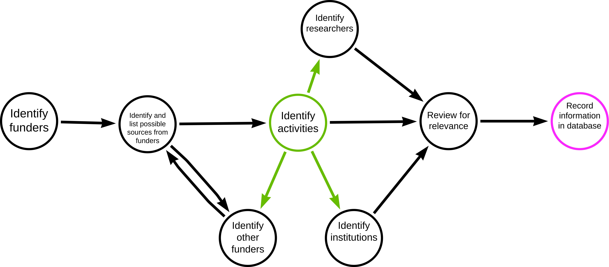

Following are the source-specific process of updating or retrieving information for the RIG database.

## Wellcome Trust Grant Funding Data {#update-wellcome}

### General Information

The Wellcome Trust is very transparent about its funding efforts and makes information about its funded projects available in several ways including on their own website and the World RePORT: (https://worldreport.nih.gov/wrapp/#/search?searchId=62a70c4bfe43c863cea97f29). I found the downloadable spreadsheet of funds awarded between 01st of October 2005 and 4th of May 2022 the most useful: https://cms.wellcome.org/sites/default/files/2022-05/Wellcome-grants-awarded-1-October-2005-to-04-05-2022.xlsx

### How to update

Please note that the steps below were done using the current available spreadsheet from the Wellcome Trust website and added the relevant projects to the RIG database. These steps can therefore be used as a guide for how to update the database with new information in the future to when the Wellcome Trust publishes its most up-to-date spreadsheet.

1. Go to column J – Recipient Org:Country -> deselect all and then select all the African countries in the list 

2. Go to column N – Planned end date -> select all the years in the future

3. These two steps reduced the list from 19,833 projects to 111 projects

4. Read the project title and decide if the project is relevant for our database or not 

5. If unsure, read the abstract – that also helps to identify the keywords to tag the project within our database 

6. If the project is relevant transfer all the information into our database


**Note:** This method is only able to detect projects/activities where an African organisation itself holds the grant. It does not detect projects where African researchers are involved as collaborators. The spreadsheet does not list collaborators on projects, so it’s yet to be determined how we will identify projects on which African research institutes collaborate with international organisations being awarded the grant.

## ClinicalTrials.gov {#update-clinicaltrials}

### How to update

Following are steps taken to extract data from [ClinicalTrials.gov](https://clinicaltrials.gov/).
 
1. Start with searching a disease/topic of interest  

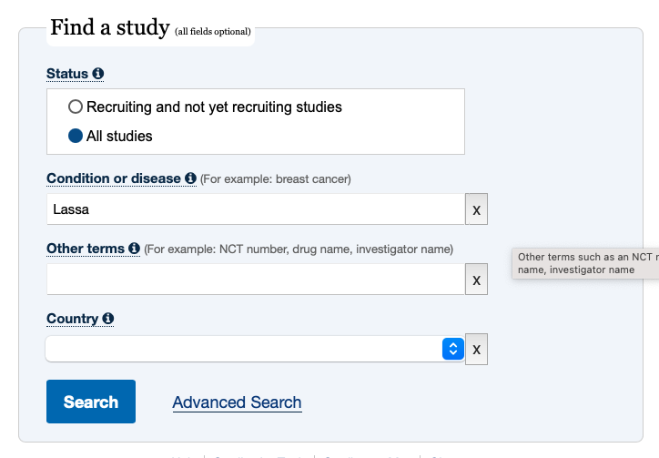

2. On the results page apply the following filters to look for active studies 

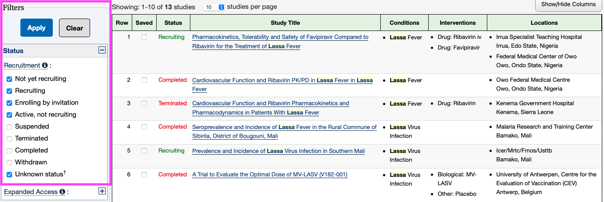

3. Click on ‘Apply’ and then look manually through the column ‘Locations’ of the list of the results to find studies that take place in African countries 

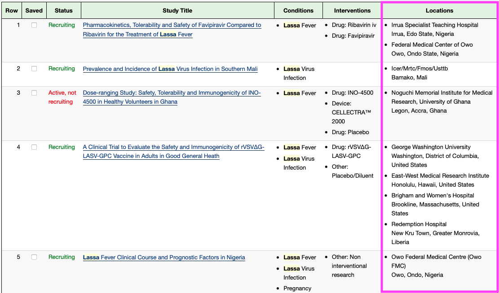

4. Click on the first study to start working your way through the information available 

5. The first information provided is the sponsor -> this information should be added to the Funder – column in the Activities table 

6. Information about collaborators can be added to Collaborators column 

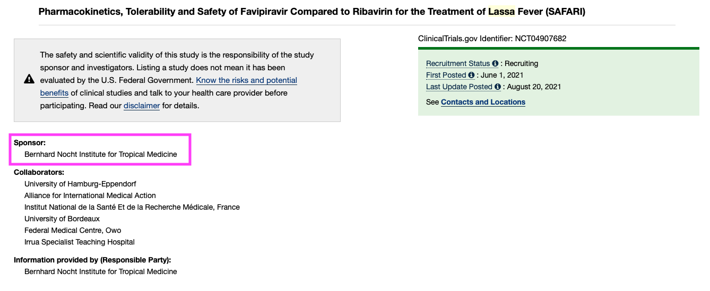

7. Staying in the ‘Study Details’-tab, scroll down to ‘Study Design’  

8. This section contains the official title, which should be used as the name for the Activity  

9. Additionally it contains information about the start and end date, which should be copied into the respective fields in the Activities table  

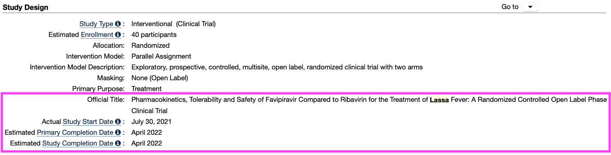

10. Scroll further down to ‘Contact and Locations’ 

11. The information given under contacts should be added to the Researcher column in Airtable  

12. Switching into the Researcher-table within in Airtable the given contact details should be added to the newly created entries for the involved researchers  

13. Also the affiliation to a certain institute can be added based on these information as well as the researcher’s location -> is it possible to link the Location with the Affiliation so that the location is automatically added based on the information about the institution the researcher is affiliated with? 

14. Switch back into the Activities table and add information about the Locations to the Activity Location and the Institutions columns  

 
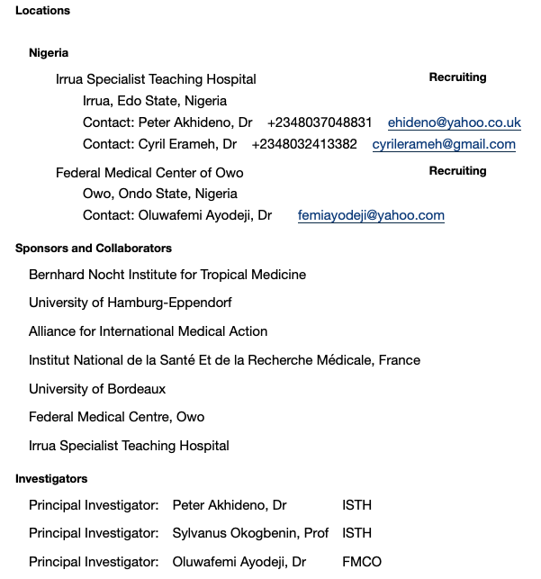
 

15. Scroll up again to the selection of tabs 

16. Click on the Results tab -> it’s worth checking this tab even when it’s called No Results Posted as it might still contain links to publications that are affiliated with the study  

17. These links can be copied into the Published Work column in the Activities table 

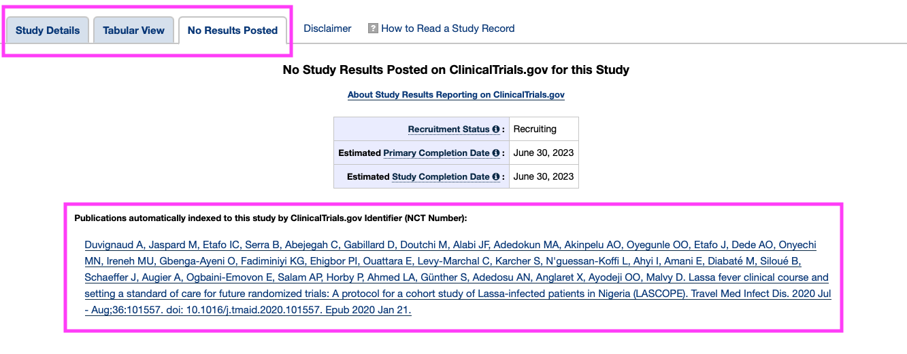
 
18. I also copied the link of the study page on clinicaltrials.gov into the Activity Website column  

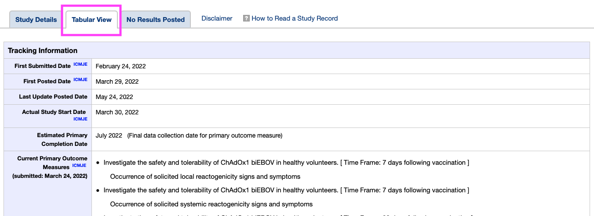

19. to determine the Research Field, I had to use my own understanding of the study so I am not sure if this can be automated or rather needs to be done by a database librarian  


## Public journal/research databases {#update-public-research}

In order to aid in automation, maintain a list relevant search terms for each topic of interest (stored in the “Topics” table in Airtable). Even if the terms are not used for the purposes of developing a search strategy, they can be used by those who are not subject matter experts when collection information on a specific topic 

 
### Example of a successful search:  

```
(zoonoses OR zoonotic disease OR zoonotic illness) and (africa*) and (surveillance OR tracking OR sampling)
```

The majority of results from this search, when conducted in [PubMed](https://pubmed.ncbi.nlm.nih.gov/), appeared relevant to the database (based on title/abstract scanning) 

 
### Example of PubMed search for surveillance activities for Brucellosis: 

```
("surveillance"[Title/Abstract] OR "prevalence"[Title/Abstract] OR "monitoring"[Title/Abstract] OR "seropositive"[Title/Abstract] OR "seroprevalence"[Title/Abstract] OR "seroevidence"[Title/Abstract] OR "screened"[Title/Abstract] OR "biosurveillance"[Title/Abstract] OR "sampl*"[Title/Abstract]) AND (brucellosis[Title/Abstract] OR "Brucella melitensis"[Title/Abstract] OR "B. melitensis"[Title/Abstract] OR "Brucella abortus"[Title/Abstract] OR "B. abortus"[Title/Abstract])  
```
 
This search yielded a large quantity of results, not all of which were relevant. Manual processes are required to validate results.  

 
Including terms to filter the results based on location were helpful, but still included results not located on the African continent. Search term to filter for African countries: 

```
(Djibouti[Title/Abstract] OR Seychelles[Title/Abstract] OR DR Congo[Title/Abstract] OR Comoros[Title/Abstract] OR Togo[Title/Abstract] OR Sierra Leone[Title/Abstract] OR Libya[Title/Abstract] OR Tanzania[Title/Abstract] OR South Africa[Title/Abstract] OR Cabo Verde[Title/Abstract] OR Congo[Title/Abstract] OR Kenya[Title/Abstract] OR Liberia[Title/Abstract] OR Central African Republic[Title/Abstract] OR Mauritania[Title/Abstract] OR Uganda[Title/Abstract] OR Algeria[Title/Abstract] OR Sudan[Title/Abstract] OR Morocco[Title/Abstract] OR Eritrea[Title/Abstract] OR Angola[Title/Abstract] OR Mozambique[Title/Abstract] OR Ghana[Title/Abstract] OR Madagascar[Title/Abstract] OR Cameroon[Title/Abstract] OR Côte d'Ivoire[Title/Abstract] OR Namibia[Title/Abstract] OR Niger[Title/Abstract] OR Gambia[Title/Abstract] OR Botswana[Title/Abstract] OR Gabon[Title/Abstract] OR Sao Tome & Principe[Title/Abstract] OR Lesotho[Title/Abstract] OR Burkina Faso[Title/Abstract] OR Nigeria[Title/Abstract] OR Mali[Title/Abstract] OR Guinea-Bissau[Title/Abstract] OR Malawi[Title/Abstract] OR Zambia[Title/Abstract] OR Senegal[Title/Abstract] OR Chad[Title/Abstract] OR Somalia[Title/Abstract] OR Zimbabwe[Title/Abstract] OR Equatorial Guinea[Title/Abstract] OR Guinea[Title/Abstract] OR Rwanda[Title/Abstract] OR Mauritius[Title/Abstract] OR Benin[Title/Abstract] OR Burundi[Title/Abstract] OR Tunisia[Title/Abstract] OR Eswatini[Title/Abstract] OR Ethiopia[Title/Abstract] OR South Sudan[Title/Abstract] OR Egypt[Title/Abstract]) 
```
 
From publications, can extract researchers, institutions, funders, activities. Ideally, researchers, institutions, and funders can be extracted automatically as opposed to manually, but scripts would need to be customized for each journal.  


### Validation of results

Validation of results can be useful to better understand the overlap between publications and activities and determine the priority of searching through publications vs. navigating to institution sites directly (or other strategies).  

After finding a relevant publication, look at the publication’s authors and their respective institutions 

Navigate to institutions’ sites to search for publications or results from research  

Are their activities listed on the site? Are those activities explicitly mentioned in the publications? Etc. 


### Some relevant journals/databases:  

* Zoonoses & Public Health from Wiley Online Library : https://onlinelibrary.wiley.com/action/doSearch?SeriesKey=18632378&sortBy=Earliest 
* Journal of Public Health in Africa: https://www.publichealthinafrica.org/jphia/issue/view/30 

* PLoS Journal of Neglected Tropical Diseases: https://journals.plos.org/plosntds/search?filterJournals=PLoSNTD 
 

## GEPRIS {#update-gepris}

### General Information:  

GEPRIS is a database listing all projects funded by the German Research Foundation (German: Deutsche Forschungsgemeinschaft; abbr. DFG) The DFG is a research funding organisation, which functions as a self-governing institution for the promotion of science and research in the Federal Republic Germany. In 2019, the DFG had a funding budget of €3.3 billion.  

### How to Use:  

The database can be accessed here: https://gepris.dfg.de/gepris/OCTOPUS?language=en&task=showSearchSimple 

This link should directly lead to the English version of the website, otherwise the language can be changed by clicking on English in the top right corner.  

 
* In the database one can search for Projects, People, or Institutions – for our purpose the project option is the most relevant  

* One can either search for keywords or filter for different criteria – for a systematic approach I found using the filtering options easier than going through all our   


1. On the search start site stay in the Projects tab. 

2. Click on Show extended search. 

3. Under Subject Area select one of the following: 

    * Agriculture, Forestry and Veterinary Medicine 

    * Basic Research in Biology and Medicine 

    * Medicine 

    * Microbiology, Virology, and Immunology  

    * Social Sciences 

    * Water Research 

    * Zoology  

**Note:** After working through all these subject areas, any relevant project in the field of One Health should be picked up by the searches 

4. Leave everything under DFG Programme as it is  

5. Move on to Funding and change Status to Current 

6. Move on to International and change Continent to Africa  

7. Click on Find 

8. Read through the project titles on the results page to identify relevant projects  

9. Import all the relevant project information (as highlighted on the screenshots) into the Africa CDC database 

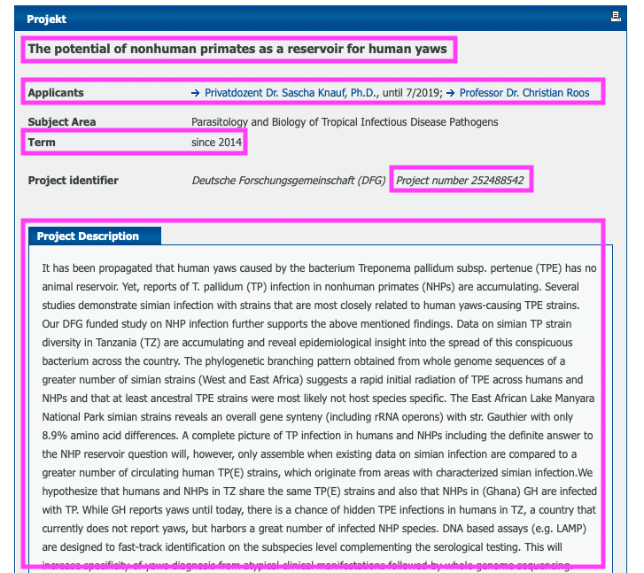
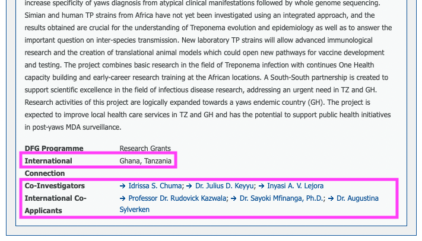

10. To identify the research institutes that are involved in the project one has to click on the researchers names and extract that information from their profile (their affiliation with a research institute is listed there)  

### Positive aspects of this source:  

The filtering options allow to filter for several criteria which are crucial for the relevance of a project to our database. That removes a lot of irrelevant projects from the results pages. The project pages list almost all the information we are interested in.  


### Downsides of this source:  

The project page doesn’t list the anticipated end date of a project.  

One has to click on the link to the researcher’s profile to identify the participating organisations. 

Even using all the different filtering options not all resulting hits are relevant for our database, so I don’t think the process can be fully automated or at least requires a subsequent manual validation or clean up step to remove irrelevant projects.  
 
 
## EDCTP {#update-edctp}

### General Information

The European & Developing Countries Clinical Trials Partnership (EDCTP) is a non-profit organisation with a European office in The Hague, The Netherlands and an African office in Cape Town, South Africa. EDCTP is a partnership between European Union (EU), Norway, Switzerland, and African countries to accelerate the development of new clinical interventions such as drugs, vaccines, microbicides, and diagnostics against poverty-related diseases in Africa. The organisation supports clinical trials, capacity strengthening and networking in Africa and Europe. Funding comes from the EU, member states, pharmaceutical industry and private organisations and charities like The Wellcome Trust and The Bill & Melinda Gates foundation.  

**Note:** Since funding comes from several sources that we also list as sources for populating the database such as the European Union (European Commission), The Wellcome Trust and The Bill & Melinda Gates Foundation, there is the possibility that downloading project information from all these sources into our database could lead to duplicate entries. I created a column in the Actvities table for the Project ID, as this might be helpful to identify duplicates and remove them automatically.   

### How to use: 

The database of funded project can be accessed here: https://www.edctp.org/edctp2-project-portal/ 

There is the option to download the list of projects as a PDF, CSV or XLXS file. Personally, I did not find that helpful for manually adding projects to the database, but it might be useful for an automated process.  

1. Go to Status of Project and select the filter Active  

2. Go to Classification and select one of the following filters: 

    - Co-Infections 
    - COVID-19 
    - Cysticercosis/Taeniasis  
    - Diagnostics 
    - Diarrhoeal Diseases 
    - Drugs 
    - Emerging Infections, incl. Ebola, Lassa 
    - Epidemiology 
    - HIV 
    - Human African trypanosomiasis (sleeping sickness)  
    - Implementation Research  
    - Leishmaniases 
    - Leprosy (Hansen disease) 
    - Lower respiratory infections  
    - Lymphatic filariasis 
    - Malaria 
    - Microbicides 
    - Onchocerciasis (river blindness) 
    - Rabies 
    - Schistosomiasis 
    - Soil-transmitted helminthiasis  
    - Social Science 
    - Tuberculosis 
    - Vaccines 
    - Yaws 
    - Yellow Fever 

**Note:** Only one Classification at a time can be selected 

3. Once one Classification was selected click on search 

4. Change from Show Map to Show List -> this makes it easier to systematically look through the projects  

5. On the results list you can see the location of the coordinating organisation, but even if it is not in an African country, it is worth checking the project details for the Participating Organisations. So read the project title and decide whether this could be a relevant project, if so, click on View details 

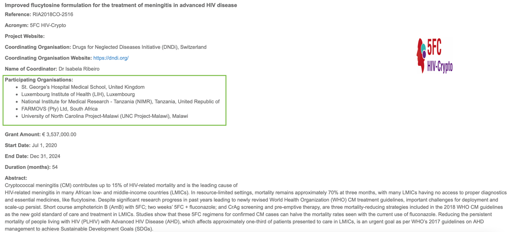

6. Check the Participating Organisations first to decide whether the project is relevant to our database:  

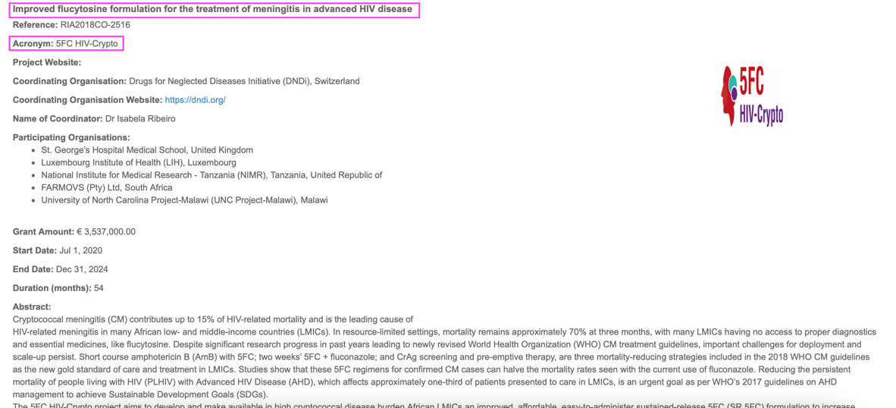

7. If the project is relevant use the Project Name + Acronym for the Activity Column  

8. Transfer all the relevant information to our database, including Project ID, Start and End date, Participating Organisations and corresponding locations, Project Website, Coordinating Organisation and Coordinating Researcher  

9. Tag the project with the correct keywords in the Activity Type, Activity Outputs, Target Species, Topic, and Research Field columns based on your understanding of the project abstract  

### Benefits of this Source:  

The projects can be easily filtered for currently active projects. 

The EDCTP is specifically focused on projects in Africa or Europe with African collaborators so most projects fulfil at least one of our selection criteria  

A lot of the projects (not all) are also topic-wise relevant for our database 

The database lists most of the information that we are interested in for our database 

### Shortcomings of this source:  

Only one disease/topic can be selected at a time so sequential searches are necessary  

Project details only list the Coordinating researcher but no other lead researchers at the participating organisations  